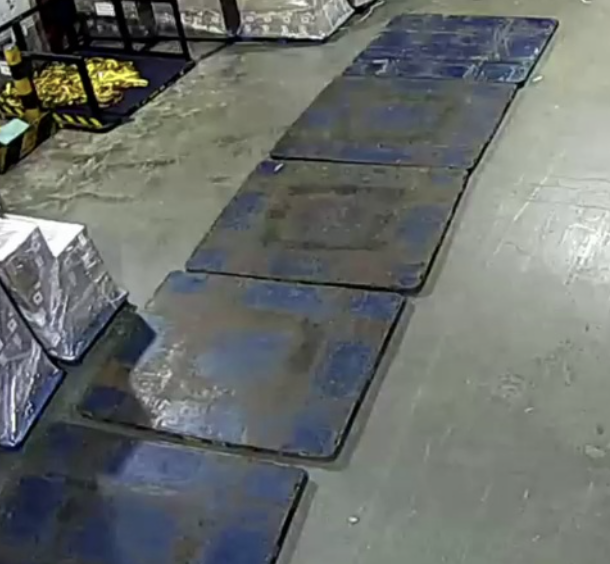

# AAT Synthetic Violation Images — Original Request & Decisions

Source: chat message from Gary Ng to Paul (screenshot: [gary-request.png](gary-request.png)).

## Original request (transcribed)

> The other one is related to 3D augmented data generation with AAT project that we will need to build an agent pipeline using Blender and GPT Astra 6 to recreating the data for training. Currently I am using Qwen 3.8 which is not having good result but Astra 6 is very strong in 3D modeling. We need to use that to produce good quality data especially for AAT project as it is not having enough violation data base to train the model. Please assign someone to work with me on this.

> The workflow should be first data collection for the background and key object like forklift, LSP, SKID and cargo in different camera and different position for those object in the camera. Then using Sam3 to extract the segmentation for each object.
>
> A clean background will be selected as the bases, then use MOGE to evaluate the depth and cross check with the size and position for each detected object from Sam3 to calibrate the depth and size for each camera.
>
> Feed the extract key objects into Astra 6 and ask it to reproduce it in 3D first like forklift, LSP, SKID and different cargo types. Prompt it few times to make sure the detail can be showed.
>
> Then ask Astra 6 to come up with all the violation scenario and randomly reproduce 3D model with volation events in different angle and direction and place the generated 3D model back to each camera background with photorealistic treatment based on the background with some earlier extracted frames to match.
>
> Readjust the prompt and make it a python model which can generate 1000 images for retraining.
>
> Train the augment model and test against the RTSP.

## Terms

**Camera (concept):** one fixed viewpoint — exactly one clean background image plus ~10 reference images showing the objects from that same viewpoint, with its own calibration (scale, floor plane, lens). It is not tied to a physical device: any set of images sharing one viewpoint counts as one camera, and one physical camera that moves (e.g. PTZ presets) gives several cameras. `camera_id` names this viewpoint.

## Decisions (2026-09-28)

| Topic | Decision |
|---|---|
| Violation type (POC) | **Forklift Pushing Multiple Lsps** (target model name): a forklift pushing cargo with more than one LSP at once is a violation; exactly one LSP is valid. Astra 6 scenario proposals are only variations of it (LSP count, arrangement, forklift heading and position, cargo type), listed in the scenario catalogue (2026-09-29 decisions below). Other violation types are out of scope |
| Count rule | Valid: at most 1 LSP. Violation: 2 or more (`is_violation = lsp_count >= 2`); the real clip shows 2. Generation default: 2 LSPs in total (primary), 3 as a less frequent variant; the mix is configurable (`lsp_count_weights` in `config.json`) |
| Input model (per camera) | Each camera has two separate inputs: (1) exactly **1 clean background image** with no forklift, LSP, SKID or cargo: the base of every output and the input to MoGe calibration; (2) **~10 reference images** from the same viewpoint showing the forklift, LSPs, SKIDs and cargo at different positions. The reference images are used only to extract objects: SAM3 crops, masks, 2D sizes and positions go into a per-camera object library (asset references, textures, size cross-check, lighting reference). They are never used as output backgrounds |
| Calibration | Once per camera: MoGe on the clean background gives depth and geometry (camera, floor plane, metric scale), cross-checked with the size and position of the SAM3-detected objects (known real sizes, e.g. the LSP). Every image of that camera reuses this calibration |
| Class name | The target model/class name is exactly `Forklift Pushing Multiple Lsps`, and the sidecar event box uses it. "Multiple LSPs" is only the existing detector's overlay text |
| LSP size | The user will supply the exact size later. Until then it is measured (agent + MoGe); once supplied it is set as `lsp_size_m` in `config.json` and overrides the measurement |
| Workstation | Pending: to be provided by stakeholders. Required: Ubuntu, an NVIDIA GPU, CUDA and SAM3 |
| How 3D is built | Astra 6 (via Codex + CLI-Anything driving Blender) rebuilds the key objects as 3D assets from the SAM3 crops: forklift, LSP, SKID and the cargo types, prompted over several passes until the details show; real crops also serve as textures. Astra 6 also builds the proxy scene and generates the variations of each approved catalogue scenario |
| Tooling | One workstation with Blender + Codex CLI (model GPT Astra 6), Blender controlled via [CLI-Anything](https://github.com/HKUDS/CLI-Anything). Codex sign-in with GPT Astra 6 available; usage bounded by the plan's limits (no API key, no budget to set) |
| Rendering approach | **Approach B**: the camera's real clean background stays as background; the Blender scene is a proxy (placement, occlusion, shadows); render only the inserted objects (forklift + cargo + LSPs + idle SKIDs) + shadows and composite them onto the background, with photorealistic treatment matched to the reference images (lighting, colour, noise, blur, compression, shadows). Same camera angle and same image format as the source. |
| Why not full re-render | A fully rendered scene looks synthetic → domain gap; the model would learn "rendered = violation" and fail on RTSP |
| Synthetic valid images | **Proposed addition (not in Gary's request):** Gary asked for violation images only. The forklift, cargo and LSPs are rendered only in synthetic images, while real valid images have none, so violation-only synthetic data would let the model learn the shortcut "rendered objects = violation". The same pipeline therefore also generates synthetic valid images (N1: forklift pushing exactly 1 LSP; N2: idle LSP row without a forklift; sidecar `is_violation: false`), so the model learns to count pushed LSPs instead of spotting rendered objects. Terry's A/B evaluation shows whether they are needed. The mix is configurable (`valid_fraction` in `config.json`) |
| Priority | Generate violation images first; labeling is Terry's step, outside this ticket |
| Labels | Owned by Terry, outside this ticket (2026-09-29 decisions below): Terry labels the images and converts them to the label format he needs. This ticket delivers the images plus JSON sidecars; the sidecar (object boxes projected from Blender, event box for violations) is a labeling hint, not a final label. SAM3 is still usable by us as a realism QA check on renders |
| Target model | The "Forklift Pushing Multiple Lsps" model, trained by Terry on real images + our generated violation and valid images. Training is outside this ticket |
| Success measure | This ticket: realistic images in the exact input format that pass human review (plan Task 15). Model gain on held-out real data (A/B vs. a real-only baseline, spec section 10) and the RTSP live test are Terry's checks, outside this ticket; if Terry reports no gain, we tune realism or the scenario mix and regenerate |
| Scale path | Agent builds assets + scenario templates once per camera, saved as reproducible scripts; mass generation (~1000 images) runs from scripts with randomized params, no LLM per image |
| POC scope | 1 camera: 1 clean background image (base of every output, MoGe input) + ~10 reference images (object extraction only); violation "Forklift Pushing Multiple Lsps"; output ~10 violation images (V1, V2) + a few (3) synthetic valid images (N1, N2); every image also has 0–2 idle SKIDs |

## Decisions (2026-09-29)

| Topic | Decision |
|---|---|
| Ticket scope | This ticket only generates violation images and synthetic valid images, plus their JSON sidecars and the generation scripts, and hands them to Terry. Terry does the labeling, the conversion to the label format he needs, the training and the testing (A/B vs. a real-only baseline, RTSP live test) |
| SKID in the POC | The SKID asset is required, not optional: Astra 6 builds it from the SAM3 SKID crops with the harness, like the forklift and cargo, with a real-crop texture (`blender/texture_asset.py`) and the same human preview gate. Every POC image places 0–2 idle SKIDs (with or without cargo on top) as scene distractors inside the floor region, away from the forklift path (`skid_count_weights` in `config.json`, default `{"0": 1, "1": 2, "2": 1}`). SKIDs never enter the event box; the sidecar lists them in `objects[]` with class `skid` |
| Scenario catalogue | [Spec section 1.1](../superpowers/specs/2026-09-28-violation-image-synth-design.md) "Scenario catalogue: Forklift Pushing Multiple Lsps" lists the scenarios of the target violation only: violation scenarios V1–V8 and look-alike valid scenes (hard negatives) N1–N5. The POC covers V1, V2 (2 and 3 LSPs in series) and N1, N2 (exactly 1 LSP pushed; an idle LSP row without a forklift). Astra 6 generates variations of each approved scenario (forklift heading and position, LSP gap and offset, cargo type and height, SKID distractors, lighting). To confirm with Terry before generation: whether V3 (stacked) and V6 (empty extra LSP) are violations, and the boundary when a forklift touches an idle LSP (N3/N4). Other violation types (aisle blocking, overstacking, pedestrians, …) are out of scope |
| Codex access | GPT Astra 6 is used through Codex CLI signed in with a plan, not through an API key, so no usage budget can be set: usage is bounded by the plan's limits. The design keeps usage low: the agent runs only in the few one-time steps (proxy scene, assets, scenario template), the 1,000-image generation is scripted with no LLM per image, and no code calls Astra 6 via an API. Plan Task 1 records the signed-in account (personal or team) and the plan's usage limits |

## LSP reference

- LSP = large thin **plastic sheet** laid flat on the floor; cargo (stretch-wrapped goods) sits on top; the forklift pushes the sheet to move the cargo.
- Look (from CCTV frame): roughly square, rounded corners, thin (~1–2 cm), blue with heavy dark/black wear and scuffs, slightly glossy.
- The reference frame shows 5 LSPs laid end to end in a row.
- Asset idea: thin bevelled box; texture taken from real SAM3 crops of LSPs (more realistic than a procedural material).

## Violation clip reference

Clip: [violation-clip-forklift-pushing-2-lsps.mp4](violation-clip-forklift-pushing-2-lsps.mp4) — frames in [violation-clip-frames/](violation-clip-frames/) (1 fps, `t01` = 0 s).

- Format: H.264, **960×540, 5 fps**, 8.2 s. Camera OSD burned in: `SENSTAR` logo top-left, timestamp top-right.
- A forklift drives away from the camera pushing cargo on LSPs; from ~4 s it pushes **2 LSPs in series** → flagged "Multiple LSPs".
- The LSPs appear as a thin strip beside/in front of the forklift, small (tens of pixels) and partly occluded by forklift + cargo — the violation is visually subtle.
- **This clip is an annotated output** of an existing detector (masks on forklift/cargo/LSP, bbox, direction arrow, floor footprint, label `Multiple LSPs ID: 5`). It is a good reference for what the violation looks like, but the overlays make it unusable as a background or training image. Raw footage without overlays is required (pending: to be provided by stakeholders).
- The existing system's red event box encloses the forklift + cargo + LSPs → likely answer to "bbox per event": one box per violation event. Our sidecar event box uses the target class `Forklift Pushing Multiple Lsps`.

## Pending inputs (to be provided by stakeholders)

- Raw (no-overlay) images from each target camera (POC: this camera), as two separate sets: (1) exactly 1 clean background image with no forklift, LSP, SKID or cargo; (2) ~10 reference images showing forklifts, LSPs, SKIDs and cargo at several positions in the view (ideally including a forklift pushing exactly 1 LSP, fully visible idle LSPs and different cargo types), used only for object extraction. The camera must not move between them. Prerequisite for plan Task 3.
- The Ubuntu GPU workstation (does not exist yet). Required: Ubuntu, an NVIDIA GPU, CUDA and SAM3. Prerequisite for plan Task 1.
- Codex sign-in on that workstation with GPT Astra 6 available (a signed-in plan, not an API key; usage bounded by the plan's limits, no budget to set). Plan Task 1 records which account it is (personal or team) and the plan's usage limits. Prerequisite for plan Task 1.
- Exact LSP size (goes into `lsp_size_m` in `config.json`; measured until then).

## Terry's work (outside this ticket)

- Labeling, the label format (YOLO / COCO) and its conversion from our sidecars, bbox per object vs. per violation event, and the target detector architecture.
- Training, the held-out real test set, the A/B pass thresholds and the RTSP pass criteria.

## Open questions

- Scenario rules, to confirm with Terry before generation: is V3 (stacked LSPs) a violation? Is V6 (empty extra LSP) a violation? Where is the boundary when a forklift touches an idle LSP (N3/N4)?
